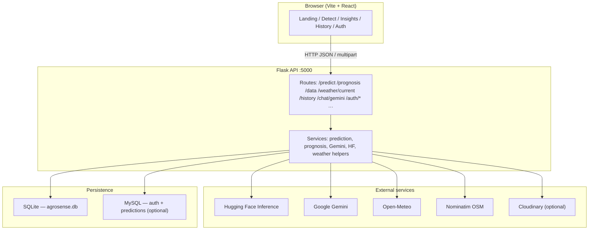

# AgroSense AI

AI-assisted crop monitoring: disease signals from images, **two-photo disease outlook** (current vs. earlier canopy), field weather insights, and explainable risk summaries tied to your location.

**Repository:** [AgroSense_ai_v2](https://github.com/prajwal1652006-hue/AgroSense_ai_v2)

---

## Problem statement

Smallholders and agronomists often notice stress or disease **too late**—after visible damage spreads. Decisions are also split across **disconnected data**: casual photos, weather memory, and ad-hoc advice. There is no single place to (1) compare **how the crop looked days ago** versus **today**, (2) combine that with **humidity, temperature, and vegetation proxy (NDVI)**, and (3) get **actionable precautions** without deploying a full agronomy lab.

## Solution (brief)

AgroSense ties together:

| Area | What it does |
|------|----------------|
| **Detect** | Upload **current** and **older** (1–3 days) photos + env inputs; **Gemini** compares images and text-grounded prognosis for outbreak likelihood, precautions, and watch signs. Optional **Gemini chat** after a run. |
| **Insights** | **Open‑Meteo** by latitude/longitude: live **temperature & humidity**, 7‑day series, heuristic **AI summary** and **feature-importance-style** bars (estimated from trends, not a separate ML explainer). |
| **History / predict** | **SQLite** history UI; **MySQL** + **Hugging Face** image classifier for classic single-image **predict** pipeline where configured. |
| **Auth** | Optional **MySQL**-backed signup/login when database is configured. |

---

## Tech stack

| Layer | Technologies |
|--------|----------------|
| **Frontend** | React 18, TypeScript, Vite 5, Tailwind CSS, shadcn/ui, React Router, TanStack Query, Recharts, Framer Motion, Lucide icons |
| **Backend** | Python 3.10+, Flask, Flask-CORS, PyMySQL, requests, Pillow |
| **AI / ML** | Google **Gemini** (vision + chat + prognosis JSON), **Hugging Face Inference** (crop disease classification), optional **Cloudinary** for image URLs |
| **Data & weather** | **Open‑Meteo** (forecast + current conditions), **Nominatim** (reverse geocode for place labels) |
| **Storage** | **SQLite** (`agrosense.db`) for local snapshots/history flows; **MySQL** for auth + predictions table when enabled |

---

## Architecture

High-level request flow (browser uses the same host as the app on **port 5000** for the API unless `VITE_API_BASE` is set):



**Detect / prognosis path (simplified):** two images + humidity, temperature, NDVI → backend builds multimodal prompt → **Gemini** returns structured outlook (risk, summary, precautions) → dashboard + optional chat using the same image context.

**Insights path:** geolocation or manual lat/lon → **Open‑Meteo** hourly + current → daily aggregates for charts; **live** temperature/humidity from `current` fields; client-side explainability heuristics for copy and bars.

---

## Prerequisites

- **Node.js** 18+ and **npm** (or Bun if you use the lockfile)
- **Python** 3.10+
- **Git**
- **API keys** (as needed):
  - `GEMINI_API_KEY` — prognosis, chat, HF fallback
  - `HF_API_KEY` — single-image disease classification (`/predict`)
  - `CLOUDINARY_*` — optional browser uploads
  - **MySQL** — only if you use auth + MySQL-backed predictions (`mysql_setup.sql` / `.env.example`)

---

## Setup on your machine

### 1. Clone

```bash
git clone https://github.com/prajwal1652006-hue/AgroSense_ai_v2.git
cd AgroSense_ai_v2
```

### 2. Backend

```bash
cd backend
python -m venv .venv

# Windows
.venv\Scripts\activate
# macOS / Linux
# source .venv/bin/activate

pip install -r requirements.txt
```

Create **`backend/.env`** from the template (do **not** commit real secrets):

```bash
copy .env.example .env   # Windows
# cp .env.example .env    # macOS / Linux
```

Edit **`backend/.env`**: set at least `GEMINI_API_KEY` for prognosis/chat; set `HF_API_KEY` and MySQL vars if you use those features. See comments in **`backend/.env.example`**.

Run the API:

```bash
python app.py
```

Default: **http://127.0.0.1:5000** (binds `0.0.0.0` for LAN testing).

First run creates **`backend/agrosense.db`** locally (gitignored).

### 3. Frontend

From the **repository root** (parent of `backend`):

```bash
npm install
```

Optional: create **`Agrosense_ai/.env`** (or project root per your layout) if the UI is not served from the same host as the API:

```env
VITE_API_BASE=http://127.0.0.1:5000
```

Start the dev server:

```bash
npm run dev
```

Open the URL Vite prints (often **http://localhost:8080**; another port is chosen if 8080 is busy). The app calls the API on **same hostname, port 5000** unless `VITE_API_BASE` overrides it.

### 4. Production build (optional)

```bash
npm run build
npm run preview
```

Serve `dist/` behind any static host; set **`VITE_API_BASE`** at build time to your public API URL.

### 5. MySQL (optional)

If you use login/signup and MySQL-backed predictions:

1. Create database and tables per **`backend/mysql_setup.sql`**.
2. Set **`MYSQL_*`** in **`backend/.env`**.
3. Restart Flask.

---

## Health checks

- **Gemini:** `GET http://127.0.0.1:5000/health/gemini`
- **Hugging Face:** `GET http://127.0.0.1:5000/health/hf`

---

## Security notes

- Never commit **`backend/.env`** or real tokens. Use **`.env.example`** only as a template.
- GitHub push protection may block commits that contain API keys—rotate any key that was ever pushed.

---

## License

Use and modify per your project policy; attribute third-party APIs (Google, Hugging Face, Open‑Meteo, OpenStreetMap) per their terms.
